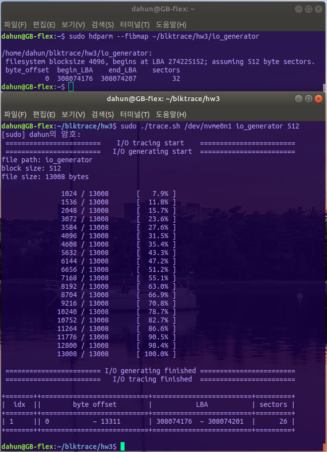
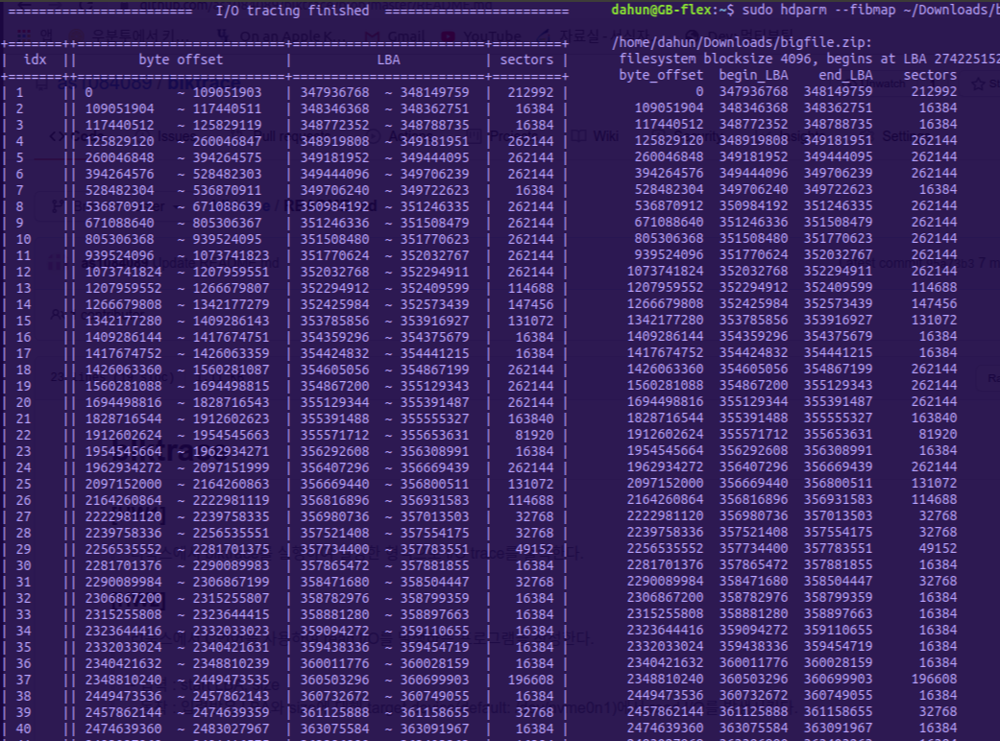

# blktrace

### [HW1]
> 리눅스에서 blktrace를 실행하여 일정한 형식으로 I/O trace를 출력한다.

### [HW2]
> 리눅스에서 C언어를 사용하여 read I/O를 발생하는 프로그램을 작성한다. 
  - 입력 : start LBA, size
  - 동작 : 입력받은 LBA와 size에 대해 target device(default: /dev/nvme0n1)에서 read I/O를 발생시킨다.

### [HW3]
> 입력으로 주어지는 파일의 byte address가 block device의 LBA로 어떻게 매핑되어 있는지 확인하는 프로그램을 작성한다.
  프로그램은 두 부분으로 구성된다. 
  - Part I: 입력으로 주어지는 파일을 512byte씩 읽는 프로그램. O_DIRECT로 open()한다.
  - Part II: 위 프로그램을 실행하면서 캡처한 blktrace의 기록을 parsing하는 프로그램을 작성한다. 
  과제 동작의 검증은 hdpam --fibmap /dev/nvme0n1 명령어를 통해 출력을 비교하였다.  
##### < 실행 사진 (hdparm과 비교, 오른쪽 사진은 4.2GB의 large file) >

</img>
</img>

> 사용법:  
  # tracing
  1. make
  2. ./trace.sh [block_device] [file_path] [i/o_size]  
  # cleaning
  1. make clean | make clean_all
